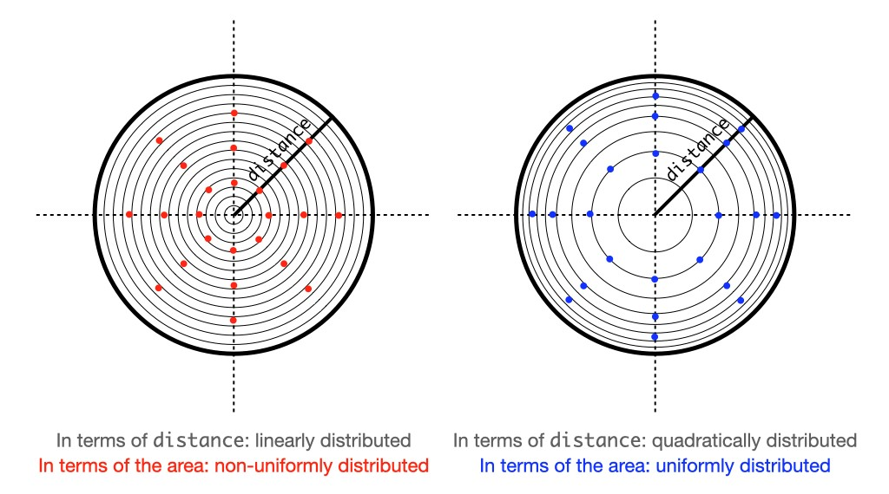

## Brief Description

### Common features

* Use `(double)rand() / RAND_MAX` to generate a random number in a range of [0,*some_number*].

### square.cpp

* Think of a square that inscribes the given circle.
* Now, generate random values for *x* and *y*, ranging from `(x_center - radius)` and `(y_center - radius)` to `(x_center - radius) + (radius * 2)` and `(y_center - radius) + (radius * 2)`, respectively.
	* If the generated random point `point` is outside the area of the circle (`distanceFromCenter(point) > radius`), repeat until the point is located inside the circle.
* Return this point.
* Please refer to the figure below for easy understanding.

### polar_coord.cpp

* Start from the polar coordinate system instead of the familiar Cartesian coordinate system.
	* [Polar coordinate system](https://en.wikipedia.org/wiki/Polar_coordinate_system "Wikipedia")
* Generate random `distance` and `theta` in a range of [0,`radius`] and [0,`2 * M_PI`] respectively, and then convert them into the corresponding Cartesian coordinates.
* The important thing here is that we need to use `sqrt` when generating a random value for `distance`.
	* Because the area of a circle is proportional to the square of its radius, the value for `distance` should be generated such that it can compensate for the relative scarcity of the outer area of the circle.
	* So `sqrt` intentionally makes the distribution of `distance` not linear but quadratic. Please see the figure below.

* Return the converted point.