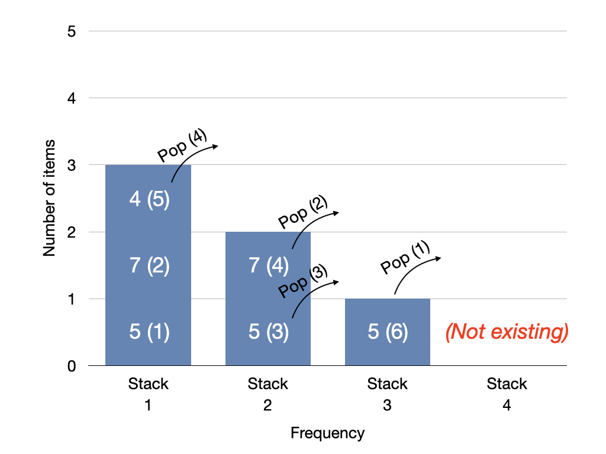

## TODO

* Modify the design of sort_dirty.cpp and clean up.

## Brief Description

### sort_dirty.cpp

* This is a *Time Limit Exceeded (TLE)* version.
* Need to modify the design, clean up, and add some descriptions.
* See below the *Accepted* version.

### stacks.cpp

* This is the *Accepted* version.
* To return the value which is the most frequent and at the same time the most recently pushed (if two or more with the same most frequency exist), we keep track of multiple stacks by frequency.
* How `push` works:
	* If given `val` is not found in the unordered map `um`, insert a new pair `{ val, 0 }` in it.
	* Increment the frequency (the value part of the key-value pair of `um`).
	* If the frequency of `val` is greater than `max_freq`, increment `max_freq` and append a new instance of `stack<int>` to the `stacks` vector.
	* Now push `val` to the correct stack at `stacks[freq - 1]`.
* How `pop` works:
	* Simply pop and return the value from the stack of the most frequency (i.e., `stacks[max_freq - 1]`) whenever it is called.
	* Before return, do some extra work left. If the current stack is empty, remove it from the `stacks` vector and decrement `max_freq`. Also, if the frequency of the current popped value became `0` in `um`, remove it.
* Below is a visualization of the algorithm with the example given in the question:
	* Input call sequence: `push(5)`, `push(7)`, `push(5)`, `push(7)`, `push(4)`, `push(5)`, `pop()`, `pop()`, `pop()`, `pop()`
	* Output popped values: `5`, `7`, `5`, `4`
	* The numbers in the parentheses indicate order.

