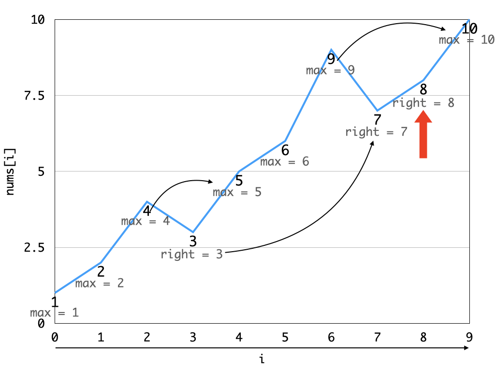
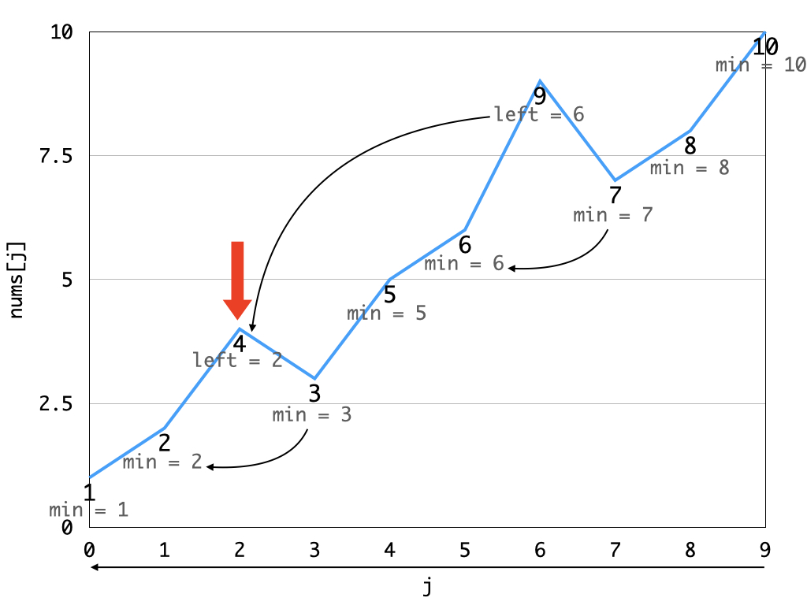

## Brief Description

### sort_and_compare.cpp

* Copy the original vector `nums` to `nums_copy` and sort it.
* Now compare `nums` and sorted `nums_copy` element by element.
* If any difference is found, return the number of elements to be sorted (which is calculated as `j - i + 1`).
* If no difference is found at all (`if (i == nums.size())`), immediately return `0`.

### two_way.cpp

* Starting from `0`, find the rightmost boundary of the shortest unsorted continuous subarray (SUCS). During this pass, we don't consider the left boundary at all.

* Starting from `nums.size() - 1`, find the leftmost boundary of the SUCS. During this pass, we don't consider the right boundary at all.

* Return the number of elements in the interval [`left`,`right`] (i.e., `right - left + 1`).
* This works well because `min` and `max` are always updated after the latest unsorted series of numbers (fluctuations in the graphs) are recorded by `left` and `right` respectively. This way, `left` and `right` point to the leftmost and rightmost boundaries of the SUCS in the end.