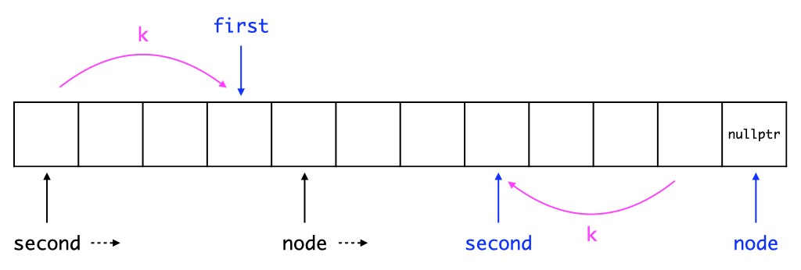

## Brief Description

### two_pass_pointer.cpp

* During the first pass:
	* Get `count` which indicates the total number of the nodes.
	* Save the value of the `k`th node in `val`.
	* Also save the address of the value of the `k`th node in `valp`.
* During the second pass:
	* Rewind `node` to point to `head`.
	* Advance `node` and decrement `count` until `count` becomes `k`.
* Now swap:
	* Assign `node->val` to the value `valp` points to.
	* Also assign `val` to `node->val`.
	
### two_pass_pointer_clear.cpp

* This is a clear version of **two_pass_pointer.cpp**.

### one_pass.cpp

* First, find the `k`th node from the beginning and save it to `first`.
* Next, find the `k`th node from the end and save it to `second`.
	* Here, if we assign `head` to `second` and `first->next` to `node` and advance both of them, `second` will point to the `k`th node from the end when `node` points to `nullptr` (i.e., when the `for` loop terminates). This is because the positions of `second` and `node` differ by `k`.
	* See the figure below, with `k` being `4` for example.

* Now swap `first->val` and `second->val`.